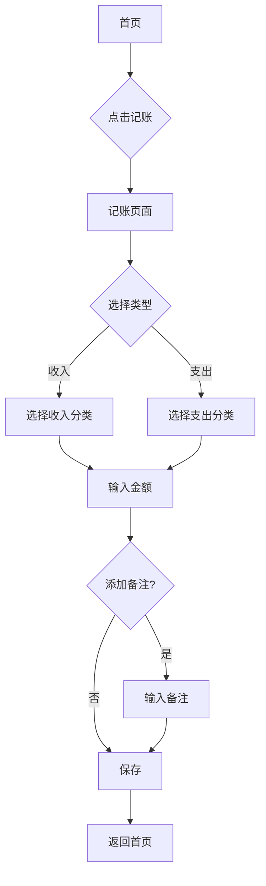

## 1. Product Overview
一款简洁易用的手机记账应用，帮助用户轻松管理个人财务，记录日常收支，查看财务报表。
- 主要功能：快速记账、分类管理、数据统计、预算设置
- 目标用户：需要管理个人财务的普通用户，追求简单高效的记账体验

## 2. Core Features

### 2.1 User Roles
| Role | Registration Method | Core Permissions |
|------|---------------------|------------------|
| User | 本地存储（无注册） | 创建、查看、编辑、删除记账记录 |

### 2.2 Feature Module
1. **首页仪表盘**: 今日收支概览、快捷记账入口、月度统计卡片
2. **记账页面**: 选择收支类型、输入金额、选择分类、添加备注
3. **分类管理**: 查看和管理收支分类
4. **统计报表**: 月度/年度收支统计图表

### 2.3 Page Details
| Page Name | Module Name | Feature description |
|-----------|-------------|---------------------|
| 首页仪表盘 | 概览卡片 | 显示今日收入、支出、余额 |
| 首页仪表盘 | 快捷记账 | 一键进入记账页面 |
| 首页仪表盘 | 月度统计 | 本月收支趋势图表 |
| 记账页面 | 金额输入 | 数字键盘输入金额 |
| 记账页面 | 分类选择 | 选择收支分类图标 |
| 记账页面 | 备注功能 | 添加交易备注信息 |
| 分类管理 | 分类列表 | 查看所有收支分类 |
| 分类管理 | 添加分类 | 创建新的收支分类 |
| 统计报表 | 月度统计 | 月度收支饼图和趋势图 |
| 统计报表 | 年度统计 | 年度收支对比图表 |

## 3. Core Process

### 用户记账流程
1. 用户进入首页，点击"记账"按钮
2. 选择收入或支出类型
3. 输入金额
4. 选择分类
5. 可选添加备注
6. 确认保存记录

## 4. User Interface Design

### 4.1 Design Style
- **主色调**: 清新绿色系（#10B981），代表财务健康
- **辅助色**: 温暖橙色（#F59E0B）用于强调按钮
- **按钮风格**: 圆角矩形，主按钮绿色背景白色文字
- **字体**: 简洁无衬线字体，标题加粗，内容常规
- **布局风格**: 卡片式布局，清晰的信息层级
- **图标风格**: 简洁线条图标，统一风格

### 4.2 Page Design Overview
| Page Name | Module Name | UI Elements |
|-----------|-------------|-------------|
| 首页仪表盘 | 顶部状态栏 | 日期显示、账户余额 |
| 首页仪表盘 | 快捷记账按钮 | 圆形浮动按钮，带有加号图标 |
| 首页仪表盘 | 收支卡片 | 横向排列，显示收入/支出金额 |
| 首页仪表盘 | 月度图表 | 柱状图展示月度收支趋势 |
| 记账页面 | 类型切换 | 顶部Tab切换收入/支出 |
| 记账页面 | 金额显示 | 大字体显示输入金额 |
| 记账页面 | 数字键盘 | 底部数字输入区域 |
| 记账页面 | 分类选择 | 网格布局分类图标 |
| 分类管理 | 分类列表 | 分组显示收入/支出分类 |
| 统计报表 | 时间筛选 | 月份/年份选择器 |
| 统计报表 | 图表区域 | 饼图和柱状图组合展示 |

### 4.3 Responsiveness
- 移动端优先设计
- 响应式布局适配不同屏幕尺寸
- 触控优化，按钮尺寸适合手指点击

### 4.4 Animations
- 页面切换淡入淡出效果
- 记账成功动画反馈
- 图表加载动画