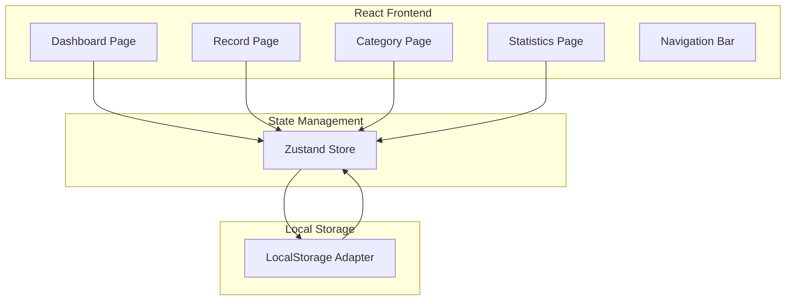
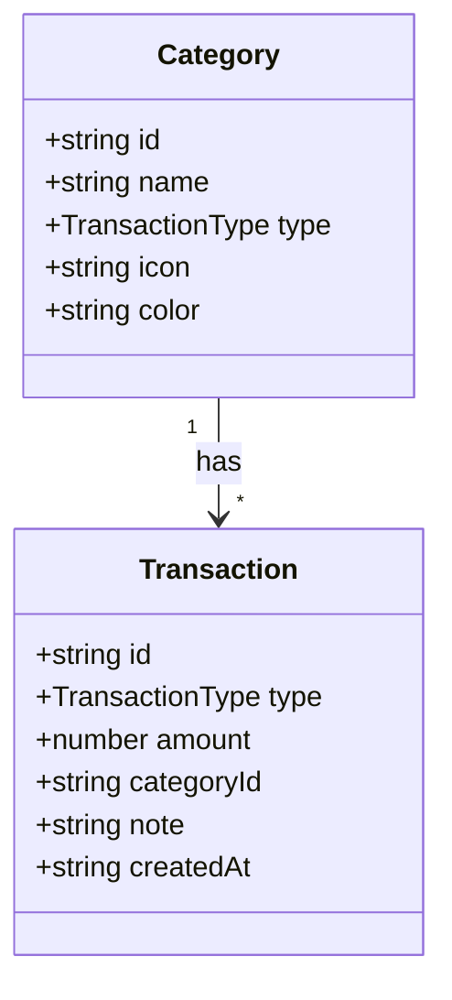

## 1. Architecture Design



## 2. Technology Description

* Frontend: React\@18 + TypeScript + Vite

* Styling: TailwindCSS\@3

* State Management: Zustand

* Icons: Lucide React

* Charts: Recharts

* Storage: LocalStorage (本地存储)

* Initialization Tool: vite-init

## 3. Route Definitions

| Route       | Purpose | Component  |
| ----------- | ------- | ---------- |
| /           | 首页仪表盘   | Dashboard  |
| /record     | 记账页面    | Record     |
| /categories | 分类管理    | Categories |
| /statistics | 统计报表    | Statistics |

## 4. API Definitions (Local Storage)

### 4.1 Storage Keys

| Key          | Type           | Description |
| ------------ | -------------- | ----------- |
| transactions | Transaction\[] | 所有交易记录      |
| categories   | Category\[]    | 所有分类        |

### 4.2 Data Types

```typescript
type TransactionType = 'income' | 'expense';

interface Category {
  id: string;
  name: string;
  type: TransactionType;
  icon: string;
  color: string;
}

interface Transaction {
  id: string;
  type: TransactionType;
  amount: number;
  categoryId: string;
  note: string;
  createdAt: string;
}
```

## 5. Server Architecture Diagram

* 本项目为纯前端应用，无需后端服务器

* 数据通过LocalStorage进行持久化存储

## 6. Data Model

### 6.1 Data Model Definition



### 6.2 Initial Data

#### 默认分类数据

**收入分类:**

| id    | name | type   | icon       | color   |
| ----- | ---- | ------ | ---------- | ------- |
| inc-1 | 工资   | income | Wallet     | #10B981 |
| inc-2 | 奖金   | income | Gift       | #34D399 |
| inc-3 | 投资收益 | income | TrendingUp | #6EE7B7 |
| inc-4 | 其他收入 | income | Plus       | #A7F3D0 |

**支出分类:**

| id    | name | type    | icon            | color   |
| ----- | ---- | ------- | --------------- | ------- |
| exp-1 | 餐饮   | expense | UtensilsCrossed | #EF4444 |
| exp-2 | 交通   | expense | Car             | #F97316 |
| exp-3 | 购物   | expense | ShoppingBag     | #F59E0B |
| exp-4 | 娱乐   | expense | Gamepad2        | #EAB308 |
| exp-5 | 医疗   | expense | Heart           | #84CC16 |
| exp-6 | 教育   | expense | GraduationCap   | #22C55E |
| exp-7 | 住房   | expense | Home            | #14B8A6 |
| exp-8 | 其他支出 | expense | MoreHorizontal  | #6366F1 |

#### 示例交易数据

| id    | type    | amount | categoryId | note | createdAt           |
| ----- | ------- | ------ | ---------- | ---- | ------------------- |
| txn-1 | expense | 35     | exp-1      | 午餐   | 2024-01-15T12:30:00 |
| txn-2 | income  | 15000  | inc-1      | 1月工资 | 2024-01-10T09:00:00 |
| txn-3 | expense | 120    | exp-3      | 日用品  | 2024-01-14T15:45:00 |

## 7. Project Structure

```
src/
├── components/          # 通用组件
│   ├── Header.tsx
│   ├── BottomNav.tsx
│   ├── CategoryCard.tsx
│   ├── TransactionCard.tsx
│   └── StatCard.tsx
├── pages/              # 页面组件
│   ├── Dashboard.tsx   # 首页仪表盘
│   ├── Record.tsx      # 记账页面
│   ├── Categories.tsx  # 分类管理
│   └── Statistics.tsx  # 统计报表
├── store/              # 状态管理
│   └── useStore.ts
├── utils/              # 工具函数
│   ├── storage.ts      # LocalStorage操作
│   └── format.ts       # 格式化工具
├── data/               # 初始数据
│   └── initialData.ts
├── types/              # 类型定义
│   └── index.ts
├── App.tsx
├── main.tsx
└── index.css
```

## 8. Development Guidelines

### 8.1 Code Standards

* 使用TypeScript进行类型检查

* 组件命名使用PascalCase

* 文件命名使用kebab-case

* 函数命名使用camelCase

### 8.2 Styling Guidelines

* 使用TailwindCSS进行样式开发

* 颜色变量定义在index.css中

* 响应式设计适配移动端

### 8.3 State Management

* 使用Zustand管理全局状态

* 状态更新通过action函数

* 数据自动同步到LocalStorage

### 8.4 Testing Guidelines

* 使用Vitest进行单元测试

* 测试文件放在\_\_tests\_\_目录

* 覆盖核心业务逻辑

